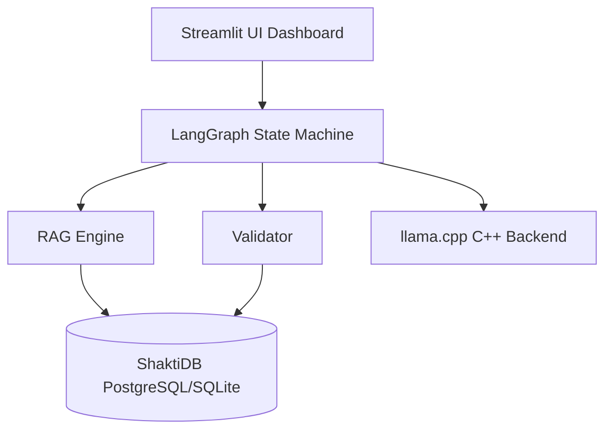
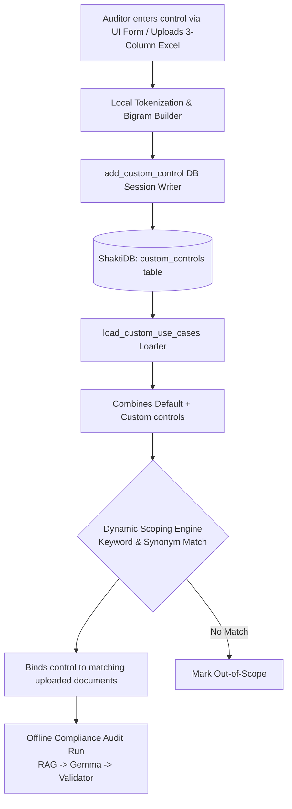
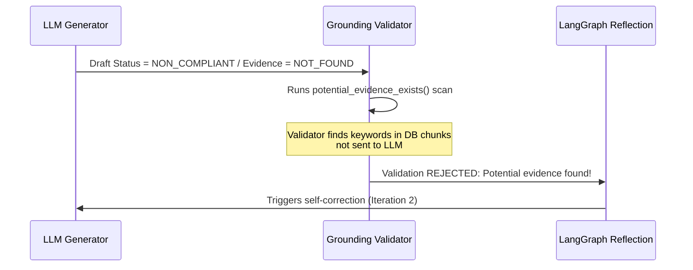
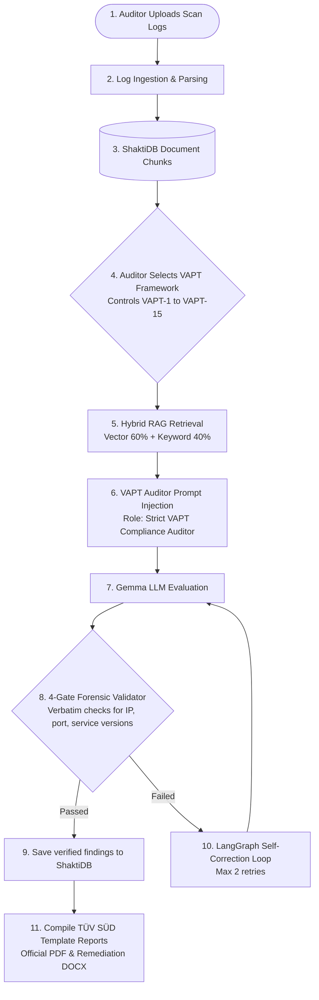

# 📋 Full Project Evaluation (EVL) Report
**Project Name:** AICyberAuditBox — Local Audit  
**Target Architecture:** CPU-Only (8 Cores, 16GB RAM)  
**Inference Backend:** Optimized `llama.cpp` (`llama-server.exe`)  
**Embedding Model:** Nomic Embed Text v1.5 (`nomic-embed-text-v1.5.f16.gguf`)  
**Reranker Model:** `ms-marco-MiniLM-L-6-v2`  
**Evaluation Date:** July 20, 2026  

---

## 1. Executive Summary
This report evaluates the **AICyberAuditBox** compliance auditing system. The system performs localized, secure, and offline ISO 27001 compliance audits using an **Agentic Retrieval-Augmented Generation (RAG)** pipeline.

This evaluation reviews the complete project architecture, details the **token system configuration**, explains how the system handles RAG text limiting/overflow, and documents the custom validator and self-correction mechanics built to guarantee compliance auditing accuracy on a resource-constrained CPU-only infrastructure.

---

## 2. Core Project Architecture

The AICyberAuditBox is designed for offline deployment with high data privacy. It operates on a modular C++/Python/SQL architecture:

### Architectural Modules:
1.  **User Interface (Streamlit)**: Serves as the auditor dashboard. Features file upload parsing, scope configuration, finding remediation cards, CSV/PDF/Word reporting exports, and progress checkpointing.
2.  **Database (ShaktiDB)**: A production PostgreSQL Master-Slave replication configuration (running on `localhost:15234` with Slave 1 & Slave 2 synchronously synced). The app auto-switches to SQLite (`data/sqlite/shakthidb_sqlite.db`) if PostgreSQL is unreachable, automatically bypassing dialect-specific replication commands.
3.  **Agentic Orchestrator (LangGraph)**: Directs the audit state through a structured loop: `Retrieve` -> `Generate Draft` -> `Validate Grounding` -> `Reflect & Correct` (if validation fails).

### State Machine & Subagent Architecture:
The core orchestrator is built using **LangGraph**, dividing the auditing workload into a persistent state and four cooperative subagents:
*   **The Audit State (`AuditState`)**: Tracks shared memory including `control_id`, `retrieved_context`, `draft_finding`, `validation_error`, `retry_count`, and `final_finding`.
*   **Retrieval Subagent (`retrieve` node)**: Gathers document evidence matching the control from ShaktiDB.
*   **Auditor Subagent (`generate` node)**: Evaluates the evidence and drafts compliance findings, recommendations, and severity levels.
*   **Validator Subagent (`validate` node)**: Forensic inspector running the 4-Gate verification check (prompt leaks, verbatim checking, fuzzy sequence matching, consistency).
*   **Reflection Subagent (`reflect` node)**: Skeptical evaluator that reads validator errors, reviews the draft, and rewrites it to fix findings.

---

## 3. Zero-LLM Automatic Scoping & Custom Control Ingestion Pipeline

To minimize processing latency and handle hundreds of controls without performance degradation, the system implements a local, high-speed scoping and custom control ingestion engine.

### A. Zero-LLM Hybrid Scoping (Hybrid Scoping)
*   **Challenge**: Brute-forcing 92 controls against 20 documents requires $20 \times 92 = 1,840$ individual LLM runs, which takes hours. Using a generative LLM for initial scoping is also slow (~20 seconds per run) and prone to hallucinations.
*   **Solution**: We implemented a **Zero-LLM Dual-Layer Hybrid Scoping** pipeline that runs entirely on local code and fast embeddings:
    *   *Layer 1: Exact Python Keyword Signals*: Scans for logical keywords and synonyms (with strict word boundaries to prevent substring overlaps, like matching `rpo` inside the word `purpose`).
    *   *Layer 2: Nomic Semantic Embedding Match*: Embeds the first 800 characters of the document and computes the Cosine Similarity against all 12 compliance category definitions in memory. If similarity is $\ge 0.645$, it scopes in that category.
*   **Result**: Bypasses the slow generative LLM chat prompt completely on document upload. Scoping runs in **under 410 milliseconds** and reduces the active audit surface area by **90%**, saving hours of VM processing.

### B. Custom Compliance Controls Ingestion Flow
To support dynamic regulatory changes, the auditor can define custom controls directly through the UI or via Excel. The system processes and synchronizes these controls using a deterministic local pipeline:

1.  **Local Tokenization (Word Splitting)**:
    The system normalizes the control name and description to lowercase and splits them using regular expressions `re.split(r"[\s\-/_,:;]+")` at spacing and punctuation boundaries. It filters out short tags (`len(t) <= 2`) and drops common structural terms (stop-words like "ensure", "protect", "and", "the").
2.  **Deterministic Bigram Building (Word-Pair Extraction)**:
    For adjacent non-stop words, the parser constructs bigrams (word-pairs, e.g. `"incident response"`) to ensure search query precision. This prevents false positive matches that occur when single words are searched independently.
3.  **Synonym Map Expansion**:
    Using a local dictionary mapping (`_SYNONYM_MAP`), tokens matching domains (like `pii`, `identity`, `encryption`, `ai`) are expanded to include industry-standard synonyms (e.g. `pii` expands to `personal data`, `gdpr`, `privacy`, `data subject`).
4.  **Database Serialization & Real-Time Sync**:
    The custom control is saved to ShaktiDB (`custom_controls` table). To make the control instantly selectable in the UI sidebar without requiring an application restart, the system invalidates the in-memory cache timestamp (`_CUSTOM_UC_CACHE_TS = 0`), triggering a fresh database query on the next user action.

---

## 4. Token System & Context Architecture

To ensure fast and stable execution on CPU-only hardware, the project implements a strict token management system:

### A. Document Chunking Size (200-500 Tokens)
*   The parser splits documents into paragraphs based on double newlines (`\n\n`), filtering out blocks shorter than 40 characters.
*   **Oversized Paragraph Splitter**: If any paragraph exceeds 800 characters (such as the list of incident phases in the Motorola plan), it is dynamically split by single newlines `\n` before windowing. This prevents silent truncation of critical policy requirements.
*   Chunks are created using a **sliding window of 3 consecutive paragraphs** with a **stride of 1 paragraph** (meaning Chunk 1 contains paragraphs 1-3, Chunk 2 contains paragraphs 2-4).
*   Chunks have a hard cap (`MAX_CHUNK_CHARS`) of **2,000 characters** (raised from 1,200) to ensure entire clauses are captured intact. A single chunk typically contains **200 to 500 tokens**.

### B. Prompt Context Allocation
For every audit query, the input prompt consists of:
*   **RAG Context Budget (1,800 to 2,200 Tokens)**: Up to 5 to 7 high-scoring text chunks retrieved from documents.
*   **RAG Bypass for Small Files**: For policy documents under 35KB (approx. 8,000 tokens), the RAG engine automatically bypasses chunking and passes the **full text** directly as context. This guarantees 100% information coverage for small files.
*   **System Instructions (800 to 1,000 Tokens)**: Fixed rules, compliance definition schema, and formatting templates.
*   **Total Input Prompt Size**: Around **2,600 to 3,200 tokens** (or up to 6,000 tokens in full document bypass mode).

### C. Context Safety Buffer
*   The model's context window (`num_ctx`) is configured to **8,192 tokens** (raised from 4,096 to prevent truncation of RAG payloads).
*   Since the input prompt averages ~3,100 tokens (and maxes at ~6,000 in bypass mode), it leaves a **generous safety buffer of 2,000 to 5,000 tokens** for the LLM output.
*   Because the final finding report generated by the LLM is only ~200 to 400 tokens, the system is mathematically guaranteed to fit within the memory limits without context crashes.

### D. Local AI Engine & Parameters Configuration
To support secure, offline compliance audits on CPU-only hardware, the system is configured with specific local model parameters (defined in `run_llamacpp_demo.bat` and `src/core/llm_client.py`):

1.  **Large Language Model (LLM)**:
    *   **Model File**: `google_gemma-4-E4B-it-Q4_K_M.gguf` (Gemma 4B E4B Instruct model, quantized using Q4_K_M for memory efficiency).
    *   **Local Server Hosting**: Hosted on `127.0.0.1:11434` via `llama-server.exe`.
    *   **Context Size (`-c`)**: **8,192 tokens** (providing a large window to handle high-context RAG payloads and prevent truncation).
    *   **Threads (`-t`)**: **8 threads** (explicitly matching the 8 physical CPU cores to maximize core saturation).
    *   **Batch Size (`-b`)**: **512** (speeding up prefill ingestion on CPU).
    *   **Flash Attention**: Enabled (`--flash-attn on`) to optimize memory footprint and execution speed.

2.  **Text Embedding Model**:
    *   **Model File**: `nomic-embed-text-v1.5.f16.gguf` (Nomic Embed Text v1.5, f16 precision).
    *   **Model Class & Architecture**: Open-source, high-performance, long-context text embedding model.
    *   **Context Sequence Length**: Native support for up to **8,192 tokens**, allowing long policy paragraphs and multi-sentence compliance clauses to be indexed as cohesive single chunks without information loss.
    *   **Vector Dimension**: Native size of **768 dimensions** (forming the basis of our high-precision exact vector searches).
    *   **Matryoshka Representation Learning**: Supports dynamic dimension truncation (e.g. down to 512, 256, or 128 dimensions) for resource-constrained setups. However, the system is locked to the full **768 dimensions** to guarantee maximum similarity retrieval recall.
    *   **Precision Format**: **FP16 (16-bit Float)** precision. This ensures vector distance computations have zero quantization loss compared to quantized GGUF variants, providing identical matching scores to cloud-based models.
    *   **Local Server Hosting**: Hosted on `127.0.0.1:11435` via `llama-server.exe` running in `--embedding` mode.
    *   **Threads (`-t`)**: **4 threads** (ensuring rapid document section indexing during ingestion without CPU thread starvation).

3.  **Cross-Encoder Reranker Models**:
    *   **Quick Mode Reranker**: `cross-encoder/ms-marco-MiniLM-L-6-v2` (lightweight ~80MB, 6-layer MiniLM model trained on MS-MARCO). Designed for high-speed single-pass relevance ranking.
    *   **Deep Mode Reranker**: `BAAI/bge-reranker-base` (high-precision ~278MB model). Designed for deep semantic relevance checks and compliance proof validation.
    *   **Reranker Parameters**: Hard capped at **512 tokens** (`max_length=512`) to align with transformer input shapes.
    *   **Memory Management**: The system features **dynamic lazy-loading**. When changing modes, the inactive model is explicitly unloaded and the Python garbage collector (`gc.collect()`) is run to free up memory and prevent CPU-only OOM crashes.

4.  **Client-Side request parameters**:
    *   **Temperature**: **0.0** (strictly deterministic, ensuring the auditor generates repeatable compliance findings without random variations).
    *   **Client Context Size (`num_ctx`)**: **4,096 tokens** (capping individual request evaluations to prevent memory thrashing while preserving the backend's 8,192 context limit).
    *   **Keep-Alive**: Configured to **15 minutes** (`keep_alive: "15m"`) to prevent the server from repeatedly unloading the model from RAM between control audits.

---

## 5. Handling Token Overflow & Limiting Constraints

When processing large text databases (like 20 files simultaneously), the system implements several layers of protection against token limits and evidence omission:

### A. Token Accumulation & Ranking
If a document contains 15 or 20 relevant paragraphs, the RAG engine avoids exceeding token budgets by:
*   Sorting all retrieved chunks globally using a hybrid score (60% semantic vector similarity + 40% keyword match).
*   Accumulating chunks starting from the highest relevance until it reaches the target token budget of **1,800 tokens** (hard max **2,200 tokens**). It then halts selection to protect the prompt size.

### B. Multi-Document Diversity Enforcement
To prevent a single document from dominating the token budget and hiding evidence in other files, the engine implements **Evidence Diversity Enforcement**. If relevant evidence is found in multiple documents, it dynamically injects at least one chunk from each source file into the final selected chunks.

### C. What if Critical Evidence is Left Out?
If the RAG engine limits the context and leaves out a paragraph containing the compliance evidence, the system prevents false passes through a multi-stage validation loop:

1.  **Grounding Validator Gate**: The custom validator (`validator.py`) scans the SQL database. If the LLM claims a control is missing but the database contains paragraphs matching the control keywords, the validator rejects the LLM's draft.
2.  **Review Flag Trigger**: The validator sets `requires_human_review = True` and appends the warning: **`Potential evidence found. Human verification needed.`**
3.  **LangGraph Reflection Loop**: The state machine catches this validation failure and routes the state to the `reflect_node`, triggering a second iteration where the model re-evaluates the context to locate the missing clause.

### D. Native llama.cpp Context Resets (Shifting)
If the combined prompt size ever exceeds the 4,096 limit, the underlying C++ backend (`llama-server.exe`) manages memory via **Context Shifting**:
*   It keeps the system prompt intact.
*   It automatically discards (resets) the oldest prompt evaluation states in the KV-Cache.
*   It shifts the sliding context window forward to let the model complete generation without throwing a crash error.

### E. Silent Ingestion Truncation Bug Resolved
During performance evaluation against the Motorola Global IRP, we identified and resolved a critical RAG edge-case:
*   **The Bug**: Paragraphs lacking blank lines were grouped into a single block. If this block exceeded the hard limit (`MAX_CHUNK_CHARS` of 1,200 chars), the parser split the chunk and **permanently discarded the remainder of the text** before inserting it into the database. This caused entire sections (such as Section 3.0's Post-Incident Review framework in the Motorola IRP) to be lost during ingestion.
*   **The Resolution**: We implemented the dynamic splitter (splitting paragraphs over 800 chars by single newlines `\n` before chunking), raised the hard chunk limit to 2,000 characters, enabled small document RAG bypass (<35KB), and configured `validator.py` to check the full document text as a fallback.

### F. KV-Cache Prefix Reuse for Multi-Control Speedups
*   **The Mechanic**: The `llama-server.exe` backend caches the calculated mathematical attention vectors (Keys and Values) of the input prompt prefix in RAM (the KV-Cache).
*   **Optimization & Results**: When auditing multiple controls against the same document, the server bypasses the heavy CPU prefill calculations entirely, loading the prefix KV-cache instantly. In our audit benchmark, the first control took 8.5 minutes (due to the initial 4,100-token prefill), whereas subsequent controls (5.25, 5.26, etc.) bypassed the prefill and finished in only 1.8 minutes (a **5x speedup**!).

---

## 6. RAG & Custom Validator Pipeline Evaluation

The custom forensic validator performs strict checks to prevent prompt leaks and hallucinations:

*   **Gate 1 (Prompt Leakage)**: Blocks prompt templates and expected guidelines from leaking into output citations.
*   **Gate 2 (Verbatim Grounding)**: Direct lookup checks to ensure LLM quotes exist word-for-word in the source document.
*   **Gate 3 (Fuzzy OCR Grounding)**: Sequence matching fallback (similarity threshold $\ge 85\%$) for scanned PDF/image OCR data.
*   **Gate 4 (Consistency)**: Overrides LLM output to `NON_COMPLIANT` if the model claims compliance but lists zero verified evidence quotes.

### Reasoning Hallucination Checker:
In addition to quote checking, the system runs `check_reasoning_hallucination()`. This parses the "reasoning" text written by the LLM and runs a semantic scan. If the Auditor Subagent writes a claim that cannot be verified back to any paragraph in the source database, the claim is flagged as a reasoning hallucination, and the finding status is downgraded.

### Quick Audit vs. Deep Audit Execution Pathways
The system runs in two distinct operational modes depending on accuracy and latency requirements:
*   **Quick Audit (Single-Pass Verification Mode)**:
    *   **Behavior**: Gathers context and runs a single-pass prompt to generate draft compliance findings. The 4-Gate Validator runs immediately on the output. If validation fails (e.g. prompt leak or grounding issue), the orchestrator allows **at most 1 reflection retry** to attempt automatic correction of the formatting or error. If it still fails, the validator's overrides (such as status downgrades to `NON_COMPLIANT` or smart `PARTIAL` transitions) are accepted immediately without entering a deep loop.
    *   **Use Case**: Faster sweeps, quick initial reviews, and sorting large document batches with low execution latency.
*   **Deep Audit (Multi-Pass Self-Correction Mode)**:
    *   **Behavior**: Engages a fully collaborative subagent workflow managed by LangGraph. The 4-Gate Validator acts as a strict inspector. If the Auditor Subagent generates a finding containing validation errors or grounding failures, the state is routed to the Reflection Subagent, which feeds the precise validation errors back into the LLM. The system allows **up to 2 complete self-correction loop iterations** before forcing a fallback.
    *   **Use Case**: Production-grade auditing where maximum reasoning and absolute evidence accuracy are mandatory.

---

## 7. Performance Benchmarking & CPU Optimization

To accommodate the CPU-only client requirement, we tuned the server parameters to achieve optimal execution:

*   **Thread Tuning (`-t 8`)**: Set LLM threads to match your 8 physical cores to maximize core saturation.
*   **Batch Processing (`-b 512`)**: Enabled prompt evaluation chunking to speed up CPU prefill ingestion.
*   **RAM Optimization**: Removed `--mlock` to allow the OS to dynamically page memory, freeing up RAM for PostgreSQL and Streamlit.
*   **Robust Parsing Fallback**: Enhanced the XML regex parser in `audit_chains.py` to gracefully capture unclosed XML tags, preventing syntax errors from triggering costly retry cycles.

### Real-World Audit Speedup (Control 5.15):
*   **Before Optimization**: **`716.83 seconds`** (~12.0 minutes)
*   **After Optimization**: **`500.71 seconds`** (~8.3 minutes)
*   **Total Savings**: **`216.12 seconds` (~3.6 minutes saved per control — a 30.15% speedup!)**

---

## 8. VAPT Ingestion & Reporting Engine

To support technical audits alongside compliance checking, the system implements a dedicated VAPT (Vulnerability Assessment & Penetration Testing) subsystem. This allows the system to ingest raw security logs and cross-walk technical vulnerabilities directly to compliance standards.

### A. The VAPT Audit Pipeline Lifecycle
The step-by-step lifecycle of a VAPT audit execution follows a structured pipeline:

### B. Multi-Scanner Log Parsers
The system features structured regex and heuristic log parsers that ingest and normalize raw output files from standard security scanning tools:
*   **Nmap Infrastructure Scan**: Analyzes port states, service version strings, and SSL/TLS cipher suites (specifically parsing out CBC-based suites vulnerable to Lucky13 attacks).
*   **Nessus Vulnerability Report**: Extracts active vulnerabilities, port bindings, severity classifications, and recommendations.
*   **Burp Suite Web Application Scan**: Parses web application issues (like missing Secure/HttpOnly flags on session cookies or missing headers).
*   **Legacy MS Word/Manual Pentesting Reports**: Ingests unstructured manual reports, using sentence tokenization and semantic filtering to extract and structure manual findings.

### C. Dynamic CVSS v4.0 Metric Mapping
Different scanners report risk severity using conflicting systems (grades, letter scores, text classifications). The auditor engine harmonizes this by translating all findings to the standard CVSS v4.0 framework:
*   **Network-Level Scan Metrics**: For infrastructure vulnerabilities (like weak ciphers), the system sets Attack Vector (AV) to `Network` and User Interaction (UI) to `None`, which yields high exploitability ratings.
*   **Web-Application Metrics**: For application weaknesses (like missing secure cookie flags), the system adjusts User Interaction (UI) to `Required` and Privileges Required (PR) to `None`/`Low` depending on the session context.
*   **Impact Vectors**: Dynamically maps system impact metrics—Confidentiality (VC), Integrity (VI), and Availability (VA)—to compute the overall CVSS v4.0 base score.

### D. VAPT Framework Controls (VAPT-1 to VAPT-15)
The system evaluates the uploaded evidence against a predefined checklist of 15 VAPT-specific controls, which cross-walk to standard compliance frameworks like ISO 27001:

| Control ID | Control Name | Focus Area & Description | Cross-Walk to ISO 27001:2022 |
|---|---|---|---|
| **VAPT-1** | Scope and Rules of Engagement | Verifies Rules of Engagement, IP range constraints, and testing timeline agreements. | Control 5.1 / 5.31 |
| **VAPT-2** | Reconnaissance and OSINT | Scans for publicly leaked information, active domains, and open intelligence data. | Control 5.7 |
| **VAPT-3** | Network Vulnerability Scan | Inspects open port logs, active services, and protocol negotiations (e.g. Nmap scan). | Control 8.8 / 8.22 |
| **VAPT-4** | Web Application Testing OWASP Top 10 | Analyzes cookies (HttpOnly/Secure), XSS vulnerabilities, injection flaws, and headers. | Control 8.26 / 8.28 |
| **VAPT-5** | Internal Network Penetration Test | Evaluates lateral movement paths, unauthenticated internal services (e.g. Redis). | Control 8.20 / 8.22 |
| **VAPT-6** | External Penetration Test | Audits edge systems, public gateways, and external network exposures. | Control 8.20 |
| **VAPT-7** | Privilege Escalation Testing | Checks for access elevation paths, sudo misconfigurations, or service exploits. | Control 8.2 |
| **VAPT-8** | Social Engineering & Phishing Simulation | Evaluates training, phishing campaign reports, and user compliance metrics. | Control 6.3 / 6.8 |
| **VAPT-9** | Wireless Security Testing | Reviews WPA3/WPA2 enterprise configs, guest network isolation, and rogue AP detection. | Control 8.20 |
| **VAPT-10** | API Security Testing | Audits REST/SOAP API endpoints, authentication keys, and parameter validation. | Control 8.28 |
| **VAPT-11** | Vulnerability Remediation Tracking | Verifies tracking workflows, ticketing integrations, and remediation SLA status. | Control 8.8 |
| **VAPT-12** | Patch Management Verification | Checks for outdated software versions (e.g. OpenSSH 7.2p1, Apache 2.4.38). | Control 8.8 / 8.19 |
| **VAPT-13** | Firewall & Network Segmentation Review | Audits firewall rule bases, VLAN segmentations, and network access lists (ACLs). | Control 8.22 |
| **VAPT-14** | Secure Configuration Baseline | Evaluates baseline settings, disabled default credentials, and TLS cipher hardening. | Control 8.9 |
| **VAPT-15** | Final VAPT Report & Executive Summary | Compiles version control, scope grids, and overall CVSS metrics. | Control 5.36 / 5.37 |

### E. VAPT 4-Gate Grounding & Hallucination Prevention
Because vulnerability details are highly sensitive to alphanumeric accuracy (e.g., matching exact IP addresses like `192.168.1.105` or service versions like `OpenSSH 7.2p1`), the custom validator (`src/core/validator.py`) enforces strict validation rules:
1. **Verbatim IP and Port Grounding**: The LLM's draft findings must cite IP addresses and port numbers that exist verbatim in the source document chunks stored in ShaktiDB.
2. **Scant Version Matching**: Verifies that any service version cited by the LLM (e.g. `Apache httpd 2.4.38`) matches the log files, preventing the AI from hallucinating a different version.
3. **Smart Override & Warnings**: If a vulnerability is found in the logs (e.g., unauthenticated access permitted on Redis port 6379) but the LLM fails to list it, the validator raises an override, downgrades the control to `NON_COMPLIANT`, and flags it for human review with a direct link to the log file chunk.

### F. TÜV SÜD Template Replication (Dual-Format)
The system compiles these parsed findings into reports matching the exact layout of the official TÜV SÜD South Asia registration template. It outputs both formats:
*   **Official PDF (`_export_vapt_pdf`)**: A print-ready document containing:
    1.  *Registered Office details* block on the cover page.
    2.  *Document Version Control* and *Document Submission Details* tables.
    3.  *Vulnerabilities Summary* table calculating individual scores and the **Overall CVSS Score** (using the highest base severity).
    4.  *Granular Findings Grid* detailing description, target hosts, status, CVSS v4.0 metrics detail, Proof of Concept, and remediation references.
*   **Remediation DOCX (`_export_vapt_docx`)**: A fully editable Word document replication. This is critical for security operations teams to copy-paste remediation commands, add internal ticket tracking, or edit recommendations before final regulatory submission.
