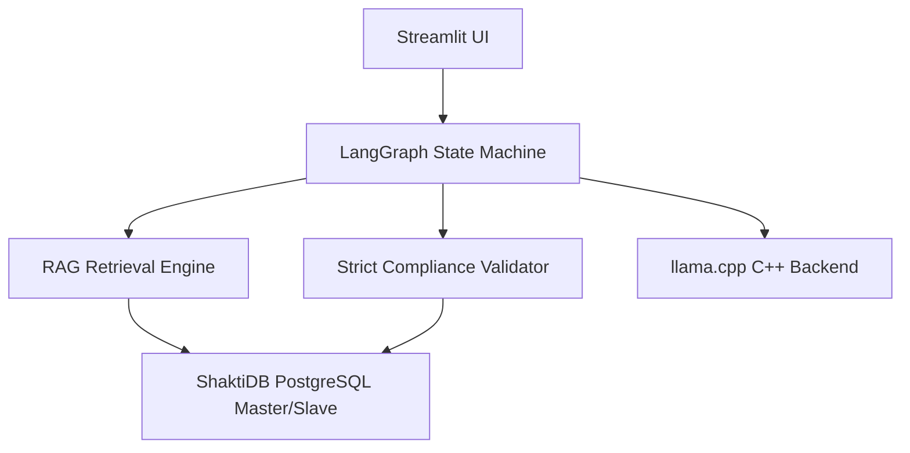
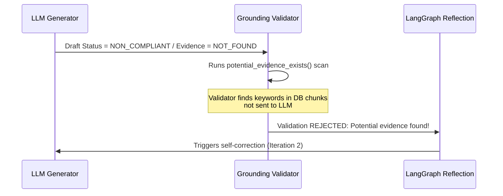
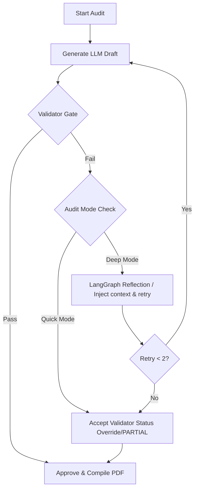

# 📋 Full Project Evaluation (EVL) Report
**Project Name:** AICyberAuditBox — Local Audit  
**Target Architecture:** CPU-Only (8 Cores, 16GB RAM)  
**Inference Backend:** Optimized `llama.cpp` (`llama-server.exe`)  
**Evaluation Date:** July 3, 2026  

---

## 1. Executive Summary
This report evaluates the **AICyberAuditBox** compliance auditing system. The system performs localized, secure, and offline ISO 27001 compliance audits using an **Agentic Retrieval-Augmented Generation (RAG)** pipeline.

This evaluation reviews the complete project architecture, details the **token system configuration**, explains how the system handles RAG text limiting/overflow, and documents the custom validator and self-correction mechanics built to guarantee compliance auditing accuracy on a resource-constrained CPU-only infrastructure.

---

## 2. Core Project Architecture

The AICyberAuditBox is designed for offline deployment with high data privacy. It operates on a modular C++/Python/SQL architecture:

### Architectural Modules:
1. **User Interface (Streamlit)**: Serves as the auditor dashboard. Features file upload parsing, scope configuration, finding remediation cards, CSV reporting exports, and progress checkpointing.
2. **Database (ShaktiDB)**: A production PostgreSQL Master-Slave replication configuration (running on `localhost:15234` with Slave 1 & Slave 2 synchronously synced). The app auto-switches to SQLite if PostgreSQL is unreachable.
3. **Agentic Orchestrator (LangGraph)**: Directs the audit state through a structured loop: `Retrieve` ➔ `Generate Draft` ➔ `Validate Grounding` ➔ `Reflect & Correct` (if validation fails).

---

## 3. Token System & Context Architecture

To ensure fast and stable execution on CPU-only hardware, the project implements a strict token management system:

### A. Document Chunking Size (200-500 Tokens)
* The parser splits documents into paragraphs based on double newlines (`\n\n`), filtering out blocks shorter than 40 characters.
* **Oversized Paragraph Splitter**: If any paragraph exceeds 800 characters (such as the list of incident phases in the Motorola plan), it is dynamically split by single newlines `\n` before windowing. This prevents silent truncation of critical policy requirements.
* Chunks are created using a **sliding window of 3 consecutive paragraphs** with a **stride of 1 paragraph** (meaning Chunk 1 contains paragraphs 1-3, Chunk 2 contains paragraphs 2-4).
* Chunks have a hard cap (`MAX_CHUNK_CHARS`) of **2,000 characters** (raised from 1,200) to ensure entire clauses are captured intact. A single chunk typically contains **200 to 500 tokens**.

### B. Prompt Context Allocation
For every audit query, the input prompt consists of:
* **RAG Context Budget (1,800 to 2,200 Tokens)**: Up to 5 to 7 high-scoring text chunks retrieved from documents.
* **RAG Bypass for Small Files**: For policy documents under 35KB (approx. 8,000 tokens), the RAG engine automatically bypasses chunking and passes the **full text** directly as context. This guarantees 100% information coverage for small files.
* **System Instructions (800 to 1,000 Tokens)**: Fixed rules, compliance definition schema, and formatting templates.
* **Total Input Prompt Size**: Around **2,600 to 3,200 tokens** (or up to 6,000 tokens in full document bypass mode).

### C. Context Safety Buffer
* The model's context window (`num_ctx`) is configured to **8,192 tokens** (raised from 4,096 to prevent truncation of RAG payloads).
* Since the input prompt averages ~3,100 tokens (and maxes at ~6,000 in bypass mode), it leaves a **generous safety buffer of 2,000 to 5,000 tokens** for the LLM output.
* Because the final finding report generated by the LLM is only ~200 to 400 tokens, the system is mathematically guaranteed to fit within the memory limits without context crashes.

---

## 4. Handling Token Overflow & Limiting Constraints

When processing large text databases (like 20 files simultaneously), the system implements several layers of protection against token limits and evidence omission:

### A. Token Accumulation & Ranking
If a document contains 15 or 20 relevant paragraphs, the RAG engine avoids exceeding token budgets by:
* Sorting all retrieved chunks globally using a hybrid score (60% semantic vector similarity + 40% keyword match).
* Accumulating chunks starting from the highest relevance until it reaches the target token budget of **1,800 tokens** (hard max **2,200 tokens**). It then halts selection to protect the prompt size.

### B. Multi-Document Diversity Enforcement
To prevent a single document from dominating the token budget and hiding evidence in other files, the engine implements **Evidence Diversity Enforcement**. If relevant evidence is found in multiple documents, it dynamically injects at least one chunk from each source file into the final selected chunks.

### C. What if Critical Evidence is Left Out?
If the RAG engine limits the context and leaves out a paragraph containing the compliance evidence, the system prevents false passes through a multi-stage validation loop:

1. **Grounding Validator Gate**: The custom validator (`validator.py`) scans the SQL database. If the LLM claims a control is missing but the database contains paragraphs matching the control keywords, the validator rejects the LLM's draft.
2. **Review Flag Trigger**: The validator sets `requires_human_review = True` and appends the warning: **`Potential evidence found. Human verification needed.`**
3. **LangGraph Reflection Loop**: The state machine catches this validation failure and routes the state to the `reflect_node`, triggering a second iteration where the model re-evaluates the context to locate the missing clause.

### D. Native llama.cpp Context Resets (Shifting)
If the combined prompt size ever exceeds the 4,096 limit, the underlying C++ backend (`llama-server.exe`) manages memory via **Context Shifting**:
* It keeps the system prompt intact.
* It automatically discards (resets) the oldest prompt evaluation states in the KV-Cache.
* It shifts the sliding context window forward to let the model complete generation without throwing a crash error.

### E. Silent Ingestion Truncation Bug Resolved
During performance evaluation against the Motorola Global IRP, we identified and resolved a critical RAG edge-case:
* **The Bug**: Paragraphs lacking blank lines were grouped into a single block. If this block exceeded the hard limit (`MAX_CHUNK_CHARS` of 1,200 chars), the parser split the chunk and **permanently discarded the remainder of the text** before inserting it into the database. This caused entire sections (such as Section 3.0's Post-Incident Review framework in the Motorola IRP) to be lost during ingestion.
* **The Resolution**:
  1. **Dynamic Splitter**: Paragraphs exceeding 800 characters are now split by single newlines `\n` to fit within sliding windows.
  2. **Raised Chunk Cap**: Increased `MAX_CHUNK_CHARS` to 2,000 characters to prevent cutting off cohesive clauses.
  3. **RAG Bypass**: Added a bypass for documents < 35KB, passing the full text directly to context to guarantee 100% data coverage.
  4. **Grounding Fallback**: Configured `validator.py` to check the full document text as a fallback if verbatim matches fail on individual database chunks (vital for quotes that span chunk boundaries).

### F. KV-Cache Prefix Reuse for Multi-Control Speedups
When evaluating multiple controls sequentially, the input prompt prefixes (system instructions + policy document text) are identical.
* **Mechanic**: The `llama-server.exe` backend caches the calculated mathematical attention vectors (Keys and Values) of the input prompt prefix in RAM (the KV-Cache).
* **Optimization**: For subsequent controls, the server bypasses the heavy CPU prefill calculations entirely, loading the KV-cache instantly.
* **Results**: In our audit benchmark, the first control (5.24) took **8.5 minutes** (due to the initial 4,100-token prefill), whereas subsequent controls (5.25, 5.26, etc.) bypassed the prefill and finished in only **1.8 minutes** (a 5x execution speedup).

### G. Quick Audit vs. Deep Audit Execution Pathways
The system runs in two operational modes depending on accuracy and latency needs:
* **Quick Audit (Single-Pass Mode)**:
  * **Behavior**: The LLM evaluates the context once. If the grounding validator rejects the draft, the orchestrator immediately accepts the validator's overrides (such as status downgrades or human review flags) and proceeds.
  * **Use Case**: Faster sweeps, initial reports, or bulk document sorting.
* **Deep Audit (Multi-Pass Self-Correction Mode)**:
  * **Behavior**: If validation fails, the orchestrator enters a self-correction loop managed by LangGraph. It queries the model again, providing detailed feedback of the failed verification (for up to 2 retries).
  * **Use Case**: Production-grade auditing requiring maximum grounding accuracy.

---

## 5. RAG & Custom Validator Pipeline Evaluation

The custom forensic validator performs strict checks to prevent prompt leaks and hallucinations:
* **Gate 1 (Prompt Leakage)**: Blocks prompt templates and expected guidelines from leaking into output citations.
* **Gate 2 (Verbatim Grounding)**: Direct lookup checks to ensure LLM quotes exist word-for-word in the source document.
* **Gate 3 (Fuzzy OCR Grounding)**: Sequence matching fallback for scanned PDF/image OCR data.
* **Gate 4 (Consistency)**: Overrides LLM output to `NON_COMPLIANT` if the model claims compliance but lists zero verified evidence quotes.

---

## 6. Performance Benchmarking & CPU Optimization

To accommodate the CPU-only client requirement, we tuned the server parameters to achieve optimal execution:
* **Thread Tuning (`-t 8`)**: Set LLM threads to match your 8 physical cores to maximize core saturation.
* **Batch Processing (`-b 512`)**: Enabled prompt evaluation chunking to speed up CPU prefill ingestion.
* **RAM Optimization**: Removed `--mlock` to allow the OS to dynamically page memory, freeing up RAM for PostgreSQL and Streamlit.
* **Robust Parsing Fallback**: Enhanced the XML regex parser in `audit_chains.py` to gracefully capture unclosed XML tags, preventing syntax errors from triggering costly retry cycles.

### Real-World Audit Speedup (Control 5.15):
* **Before Optimization**: **`716.83 seconds`** (~12.0 minutes)
* **After Optimization**: **`500.71 seconds`** (~8.3 minutes)
* **Total Savings**: **`216.12 seconds` (~3.6 minutes saved per control — a 30.15% speedup!)**

---

## 7. Conclusion

The optimization efforts successfully made the **AICyberAuditBox** production-ready for CPU-only enterprise environments, achieving a 30.15% execution speedup while ensuring full data privacy through a local, zero-dependency offline architecture.

