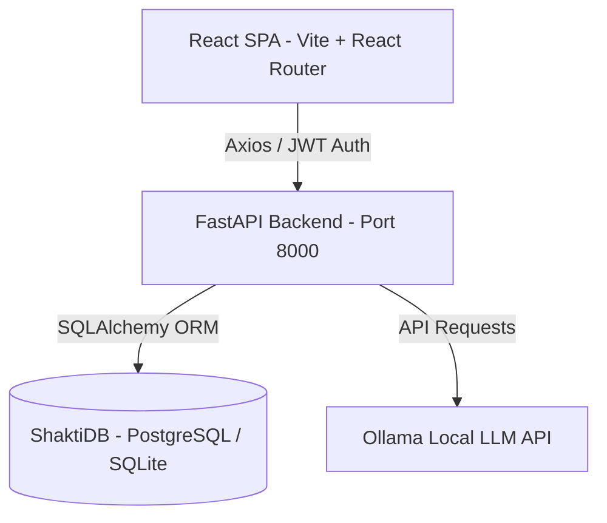

# 🚀 AICyberAuditBox: Streamlit to React + FastAPI Migration Guide & Agent Prompt

This guide contains a comprehensive **Implementation Plan** and a **Targeted AI Agent Prompt** designed to migrate the AICyberAuditBox codebase into a modern, decoupled **React (Frontend)** and **FastAPI (Backend)** stack while maintaining strict, role-based workflows (Admin, Auditor, Auditee).

---

## 📋 Table of Contents
1. [Core Architectural Overview](#1-core-architectural-overview)
2. [Database Schema Alignment](#2-database-schema-alignment)
3. [FastAPI Role-Based Access Control (RBAC) Pattern](#3-fastapi-role-based-access-control-rbac-pattern)
4. [React Protected Routing & State Management](#4-react-protected-routing--state-management)
5. [The System Migration Prompt (Copy & Paste for Other Agent)](#5-the-system-migration-prompt)

---

## 1. Core Architectural Overview



### Stack Components:
*   **Frontend**: React (Vite, React Router v6, Tailwind CSS, Axios, Context API).
*   **Backend**: FastAPI, Uvicorn, Python 3.10+, SQLAlchemy (RoutingSession for Master/Slave read-write division), Pydantic (v2) for models.
*   **Authentication**: JWT (JSON Web Tokens) with standard headers + TOTP 2FA verification.
*   **Local AI Engine**: Direct connection to local Ollama server running `Qwen 2.5 7B` or other selected models.

---

## 2. Database Schema Alignment

Ensure that the FastAPI SQLAlchemy models exactly match the normalized Streamlit tables:

*   `users`: ID, username, password_hash, role (`admin` | `auditor` | `auditee`), totp_secret, created_at.
*   `audit_reports`: ID, session_id (UUID), session_title, auditee_id (nullable, links to users.id), framework (e.g. ISO 27001), status (`Draft` | `Pending Review` | `Reviewed` | `Approved` | `Rejected` | `Sent to Auditee`), reviewed_at, created_at.
*   `evidence_files`: ID, report_id, filename, file_path, status, is_auditor_uploaded, uploaded_at.
*   `findings`: ID, report_id, control_id (e.g. A.12.6.1), control_name, severity (P1-P4), description, gap_detected, relevance_score, evidence_snippet, recommendation, status (`Compliant` | `Partially Compliant` | `Non-Compliant` | `Out Of Scope`), comment, and forensic details.
*   `chat_messages`: ID, session_id, role (`user` | `assistant`), content, created_at.
*   `system_events`: ID, event_type, actor, session_id, framework, meta (JSON string), severity, created_at.

---

## 3. FastAPI Role-Based Access Control (RBAC) Pattern

To enforce role restriction in FastAPI, use dependency injection to extract the current user and validate their role:

```python
from fastapi import Depends, HTTPException, status
from fastapi.security import OAuth2PasswordBearer
import jwt

oauth2_scheme = OAuth2PasswordBearer(tokenUrl="api/auth/login")

def get_current_user(token: str = Depends(oauth2_scheme), db: Session = Depends(get_db)):
    try:
        payload = jwt.decode(token, SECRET_KEY, algorithms=[ALGORITHM])
        username: str = payload.get("sub")
        if username is None:
            raise HTTPException(status_code=401, detail="Invalid token credentials")
    except jwt.PyJWTError:
        raise HTTPException(status_code=401, detail="Invalid token")
        
    user = db.query(User).filter(User.username == username).first()
    if user is None:
        raise HTTPException(status_code=401, detail="User not found")
    return user

# Role-checking dependency factory
class RoleChecker:
    def __init__(self, allowed_roles: list[str]):
        self.allowed_roles = allowed_roles

    def __call__(self, current_user: User = Depends(get_current_user)):
        if current_user.role not in self.allowed_roles:
            raise HTTPException(
                status_code=403,
                detail=f"Action forbidden for role '{current_user.role}'. Requires one of: {self.allowed_roles}"
            )
        return current_user
```

### Endpoint Scoping:
*   `@router.post("/api/admin/clear-db", dependencies=[Depends(RoleChecker(["admin"]))])`
*   `@router.post("/api/audit/run", dependencies=[Depends(RoleChecker(["admin", "auditor"]))])`
*   `@router.post("/api/evidence/upload", dependencies=[Depends(RoleChecker(["admin", "auditor", "auditee"]))])`

---

## 4. React Protected Routing & State Management

Maintain an `AuthContext` to store the active user's username, role, and JWT token. Protect routes using a `<ProtectedRoute>` wrapper:

```jsx
// src/components/ProtectedRoute.jsx
import { Navigate, Outlet } from 'react-router-dom';
import { useAuth } from '../context/AuthContext';

export const ProtectedRoute = ({ allowedRoles }) => {
  const { user, loading } = useAuth();

  if (loading) return <div>Loading System...</div>;
  if (!user) return <Navigate to="/login" replace />;
  if (allowedRoles && !allowedRoles.includes(user.role)) {
    return <Navigate to="/unauthorized" replace />;
  }

  return <Outlet />;
};
```

### Route Definitions:
```jsx
<Routes>
  <Route path="/login" element={<Login />} />
  
  {/* Auditee View (Strictly restricted to upload and published reports) */}
  <Route element={<ProtectedRoute allowedRoles={['auditee']} />}>
    <Route path="/auditee/dashboard" element={<AuditeeDashboard />} />
    <Route path="/auditee/upload" element={<EvidenceUpload />} />
  </Route>

  {/* Auditor / Admin View (Audit controls, Scoping, AI engine run) */}
  <Route element={<ProtectedRoute allowedRoles={['auditor', 'admin']} />}>
    <Route path="/audit/dashboard" element={<AuditorDashboard />} />
    <Route path="/audit/run" element={<RAGPipelineRun />} />
  </Route>

  {/* Admin View (LLM Configuration, Logs, Databases) */}
  <Route element={<ProtectedRoute allowedRoles={['admin']} />}>
    <Route path="/admin/monitoring" element={<AdminLogsView />} />
  </Route>
</Routes>
```

---

## 5. The System Migration Prompt (Copy & Paste for Other Agent)

Copy and paste the text block below into your other agent workspace to begin the build:

```text
You are tasked with migrating a security compliance RAG audit tool (AICyberAuditBox) from a monolithic Streamlit application to a decoupled React (Frontend) + FastAPI (Backend) architecture with SQLAlchemy (ShaktiDB) persistence. 

Please adhere strictly to the following implementation details:

### 1. User Roles & Permissions Matrix
Ensure your backend endpoints and frontend views enforce this matrix:
- **Admin**: Has full access. Exclusive rights to:
  * Select LLM engines (Qwen 2.5 3B/7B, Llama 3.1 8B, Gemma 2 9B).
  * Run system-wide DB clears.
  * Access "Admin Monitoring & Logs" containing "System Events" (logs DB connection/Ollama errors with severity tags: INFO, WARNING, ERROR, CRITICAL) and "Audit Trail" (privacy-safe logs of logins and actions).
  * Standard credentials seeded at start (username: admin / password: admin123) with TOTP 2FA secret "ADMI2FASHRDSECRT".
- **Auditor**: Standard audit workspace owner. Rights to:
  * Set active standards (ISO 27001, SOC 2, GDPR, BCMS, X-BOM).
  * Configure Scoping Mode (Automatic AI Scoping vs Manual Scoping).
  * Run/Stop the active RAG scanning pipeline.
  * View, accept, modify, and delete finding cards (P1-P4 severities).
  * Publish reports to specific Auditees (updates report status from 'Draft' to 'Sent to Auditee').
- **Auditee**: End-client portal. Restricted to:
  * Uploading evidence files (.pdf, .docx, .zip) to active sessions, sending them to the auditor (setting status to 'Pending Review').
  * Viewing finished audit reports published to them (read-only view) and downloading report PDFs.
  * NO access to AI Chat, Scoping widgets, LLM configuration, or database management.

### 2. FastAPI Backend Specifications
- Enforce JWT authentication on all routers.
- Implement a role validation dependency (RoleChecker) that raises 403 Forbidden HTTPExceptions if the user's role is not in the allowed list for the target path.
- Database Models (SQLAlchemy): Match the core schemas for:
  * User (id, username, password_hash, role, totp_secret)
  * AuditReport (session_id, session_title, auditee_id, framework, status, reviewed_at)
  * EvidenceFile (id, report_id, filename, file_path, status, is_auditor_uploaded)
  * Finding (id, report_id, control_id, control_name, severity, description, gap_detected, relevance_score, evidence_snippet, recommendation, status, comment)
  * ChatMessage (id, session_id, role, content)
  * SystemEvent (id, event_type, actor, session_id, framework, meta, severity)
- Scoping Engine API: Expose scoping utilities mapping standard selections to subsets of the 93 ISO 27001 Annex A controls.
- Ollama RAG Connection: Set up background worker threads/tasks to query local Ollama model endpoints for relevance mapping, gap analysis, and checkpointing progress after every 10 processed controls to prevent data loss.

### 3. React Frontend Specifications
- Set up an AuthContext storing authentication state, token, username, and role.
- Configure React Router with protected route layouts (`<ProtectedRoute allowedRoles={...} />`) matching the three user roles.
- Create 3 Dashboard views matching the roles:
  * `AdminDashboard`: Models selector, Full records table with clear DB action, System log tables with search filters (severity, event type).
  * `AuditorDashboard`: Framework selector, scoping checkboxes, RAG pipeline status tracker, finding cards with interactive status editing (Accept/Modify/Delete), and target auditee publish list.
  * `AuditeeDashboard`: File uploader widget, submitted file checklist with status badges, and read-only list of reports published to them with PDF download buttons.
- Styling: Premium dark mode with harmonized HSL colors, modern typography, glassmorphism containers, status badges, and smooth interactive hover micro-animations.

Begin by building the FastAPI project structure first, followed by the database setup, JWT/2FA verification middlewares, and then scaffold the React frontend routing and components. Do not use generic placeholders. Ensure code is complete and production-grade.
```

---
